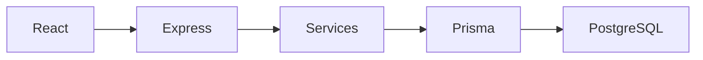

# System Design — Last-Mile Delivery Tracker

LastMile is a last-mile delivery platform. Customers or admins create orders; the API prices them from zone mappings and rate cards, assigns agents, records an immutable status timeline, emails customers, and supports failed-delivery rescheduling. Charges, zones, and assignments are computed on the server.

## Architecture

Express `/api` controllers call services: auth (JWT), zone resolution, pricing, assignment, tracking, notifications. Prisma writes PostgreSQL. The UI does not compute money or zones.

## Rate calculation

The customer (or admin for a chosen customer) enters pickup/drop, dimensions, weight, B2B/B2C, and prepaid/COD. Preview (`POST /api/orders/preview-price`) and create share `PricingService.quote`. Create recalculates; a client cannot submit a total.

1. Resolve pickup zone from the 6-digit pincode.
2. Resolve drop zone the same way.
3. Volumetric weight = **L × B × H / 5000** (cm; divisor lives on the rate card, default 5000).
4. Billable weight = **max(actual weight, volumetric weight)** and the card’s `minimumChargeableWeight`.
5. Scope is `INTRA_ZONE` if both zone ids match, else `INTER_ZONE`. Cards are filtered by `orderType` (`B2B` / `B2C`) and that scope.
6. Selection: (1) exact active source→destination pair (`EXACT_ZONE_PAIR`); (2) admin `isFallback` card with no zone ids (`INTRA_ZONE_FALLBACK` / `INTER_ZONE_FALLBACK`); (3) otherwise `MISSING_RATE_CARD` — no hidden default.
7. Shipping = `baseRate + billableWeight × perKgRate`.
8. COD surcharge is taken from the same card only when `paymentType` is `COD`; prepaid adds 0.
9. Total = shipping + COD. The quote includes `rateCardName` and `resolutionType`.

Zones and cards are PostgreSQL rows, edited in Admin. Seeded Hyderabad pairs are data, not frontend constants.

## Zone detection

The create-order UI loads `ZoneArea` localities (`GET /api/locations`). The API then receives address and pincode.

`ZoneResolutionService` treats the **pincode as authoritative**: six digits → `ZoneArea` on an **active** `Zone`. Unmapped or multi-zone pincodes return `ZONE_UNRESOLVED`. Address text naming a locality in another zone returns `ADDRESS_PINCODE_MISMATCH`. Inactive zones (seeded `HYD_EXPANDING`) are excluded from resolution; the catalog may still list them as not bookable. Coordinates come from the request, area row, or zone centroid. Nominatim is present in the repo but is **not** used for zone detection.

## Auto-assignment

Admin `POST /api/orders/:id/auto-assign` calls `AssignmentService.assignNearestAgent`.

Eligible agents: `AVAILABLE`, `isAvailable`, and in-flight count below `maxActiveOrders`. Agents with **fresh** coordinates (`locationUpdatedAt` within `LOCATION_STALE_THRESHOLD`, default five minutes) are ranked by Haversine distance to pickup; the nearest wins (`NEAREST_GEOGRAPHIC`). Stale coordinates are not used for that ranking. Otherwise: same `currentZoneId` as pickup (`SAME_ZONE_FALLBACK`), else any eligible agent (`ANY_AVAILABLE_FALLBACK`). The order becomes `ASSIGNED` and the agent `BUSY`. History stores reason, distance, and freshness. Manual assign uses the same eligibility rules.

## Status and immutable history

Happy path: `CREATED → ASSIGNED → PICKED_UP → IN_TRANSIT → OUT_FOR_DELIVERY → DELIVERED`. Failure: `OUT_FOR_DELIVERY → FAILED → RESCHEDULED → ASSIGNED`. Agents cannot skip steps. Admins may `override`. `CANCELLED` is a side exit from several states.

Every transition inserts `OrderStatusHistory` (`status`, `timestamp`, `actorId`, optional note/metadata). `TrackingService` only creates and reads rows. Prior entries are not updated or deleted, so a later success cannot erase a failure.

## Failed delivery

From `OUT_FOR_DELIVERY`, the agent marks `FAILED` and must supply a reason. The customer is emailed. They (or an admin) pick a new datetime. The platform records a reschedule request and a new delivery attempt, moves the order to `RESCHEDULED`, and tries auto-assignment again. The original failed attempt stays on the timeline; a later `DELIVERED` adds a separate `SUCCESS` attempt.

## Database

PostgreSQL via Prisma. `User` (`CUSTOMER` / `AGENT` / `ADMIN`) has optional `CustomerProfile` or `AgentProfile`. `Order` belongs to a customer user, optional assigned agent, pickup/drop `Zone`, and snapshotted charges. `Zone` has `ZoneArea` pincodes; `RateCard` references source/destination zones or is a fallback. `OrderStatusHistory`, `DeliveryAttempt`, `RescheduleRequest`, `AgentLocation`, and `Notification` hang off the order or agent. Foreign keys and decimal money/weight columns keep the model structured.

## API and security

REST JSON `{ success, data, message }`. Zod validates bodies. Passwords use bcrypt. Login/register set an HTTP-only `access_token` cookie (JWT: `sub`, email, role). Middleware reads that cookie only. Roles and ownership are enforced in services (customers cannot set `customerId`; agents see assigned orders). Pricing, assignment, and transitions stay server-side.

## Notifications

A status change maps to an event. `NotificationService` renders a template and calls `EmailService`. With `RESEND_API_KEY`, Resend sends mail (`SENT`). Development without a key logs the payload (`LOGGED`). Production without a key stores `FAILED` without failing the order. Admins can retry a failed row.

## Design principles

Pricing is configuration-driven. Business rules live in services and tested `lib` functions, not in React. Tracking is append-only. Assignment records why an agent was chosen. Access is role-based. Modules can be extended (new cards, zones, email providers) without rewriting the order path.
